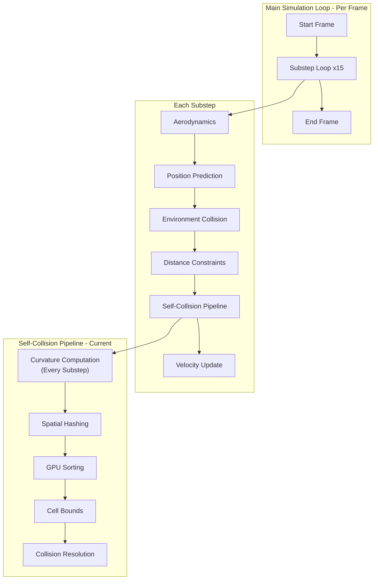
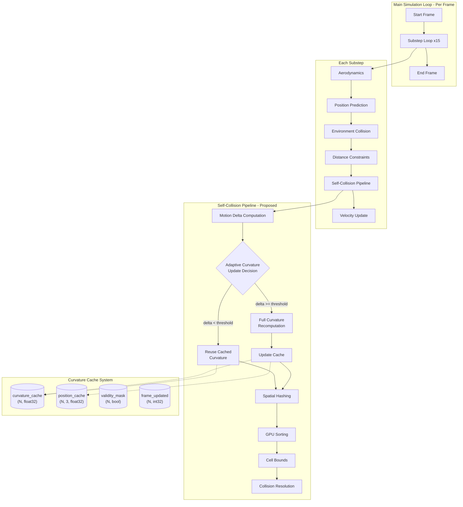
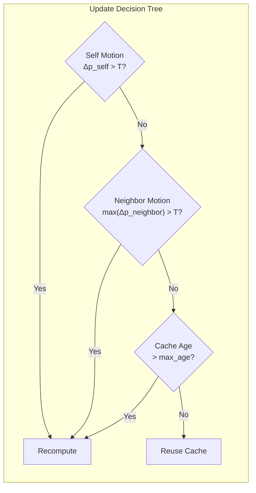
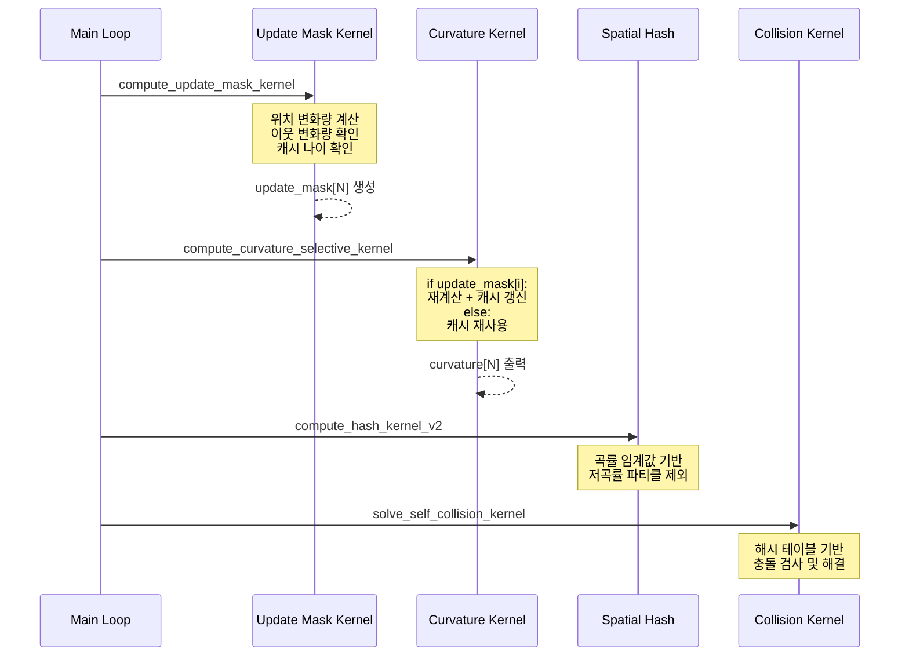

# 시공간 코히어런스(Spatio-Temporal Coherence) 기반 곡률 캐싱 시스템 설계

## 1. 전체 시스템 개요

### 1.1 기존 시스템 아키텍처



### 1.2 제안 시스템 아키텍처 (시공간 코히어런스 적용)



---

## 2. 핵심 알고리즘 설계

### 2.1 Motion Delta 기반 갱신 결정

#### 개념
파티클의 위치 변화량(Motion Delta)이 임계값보다 작으면 곡률이 크게 변하지 않았다고 가정하고 캐시된 값을 재사용합니다.

#### 수학적 근거
```
곡률 κ = ||Laplacian(p)|| = ||avg(neighbors) - p_center||

Δκ ≈ ||Δ(avg(neighbors)) - Δp_center||
    ≤ ||Δ(avg(neighbors))|| + ||Δp_center||
    ≤ max(Δp_neighbors) + Δp_center

따라서: Δp가 작으면 Δκ도 작다
```

#### 알고리즘 파라미터
| 파라미터 | 설명 | 권장 값 |
|----------|------|---------|
| `motion_threshold` | 재계산을 결정하는 위치 변화량 | `spacing * 0.05` |
| `max_cache_age` | 최대 캐시 유지 substep 수 | `5` |
| `neighbor_motion_weight` | 이웃 변화 반영 가중치 | `0.5` |

### 2.2 계층적 갱신 전략



---

## 3. 데이터 구조 설계

### 3.1 GPU 버퍼 추가 사항

```python
# 기존 버퍼
d_pos           # (N, 3) float32 - 현재 위치
d_pos_pred      # (N, 3) float32 - 예측 위치
d_curvature     # (N,)   float32 - 곡률 값

# 새로 추가할 버퍼
d_curvature_cache    # (N,)   float32 - 캐시된 곡률 값
d_pos_cache          # (N, 3) float32 - 캐시 시점의 위치
d_cache_age          # (N,)   int32   - 캐시된 이후 경과한 substep 수
d_update_mask        # (N,)   bool    - 이번 substep에서 갱신 필요 여부
```

### 3.2 메모리 오버헤드

```
추가 메모리 = N × (4 + 12 + 4 + 1) bytes = N × 21 bytes

예시 (1024 × 1024 해상도):
- 파티클 수: 1,048,576개
- 추가 메모리: ~22 MB
- 기존 대비 증가율: ~15%
```

---

## 4. CUDA 커널 설계

### 4.1 Motion Delta 계산 및 갱신 결정 커널

```python
@cuda.jit
def compute_update_mask_kernel(
    pos_current,      # (N, 3) 현재 위치
    pos_cache,        # (N, 3) 캐시된 위치
    cache_age,        # (N,)   캐시 나이
    update_mask,      # (N,)   출력: 갱신 필요 여부
    motion_threshold, # float  움직임 임계값
    max_cache_age,    # int    최대 캐시 나이
    num_x, num_y      # int    그리드 크기
):
    """
    각 파티클에 대해 곡률 재계산이 필요한지 판단
    """
    ix, iy = cuda.grid(2)
    if ix >= num_x or iy >= num_y:
        return
    
    idx = iy * num_x + ix
    
    # 1. 자기 자신의 움직임 계산
    dx = pos_current[idx, 0] - pos_cache[idx, 0]
    dy = pos_current[idx, 1] - pos_cache[idx, 1]
    dz = pos_current[idx, 2] - pos_cache[idx, 2]
    self_motion = math.sqrt(dx*dx + dy*dy + dz*dz)
    
    # 2. 이웃들의 최대 움직임 계산 (경계 체크 포함)
    max_neighbor_motion = 0.0
    
    for dy_offset in range(-1, 2):
        for dx_offset in range(-1, 2):
            if dx_offset == 0 and dy_offset == 0:
                continue
            
            nx = ix + dx_offset
            ny = iy + dy_offset
            
            if nx >= 0 and nx < num_x and ny >= 0 and ny < num_y:
                n_idx = ny * num_x + nx
                
                ndx = pos_current[n_idx, 0] - pos_cache[n_idx, 0]
                ndy = pos_current[n_idx, 1] - pos_cache[n_idx, 1]
                ndz = pos_current[n_idx, 2] - pos_cache[n_idx, 2]
                n_motion = math.sqrt(ndx*ndx + ndy*ndy + ndz*ndz)
                
                if n_motion > max_neighbor_motion:
                    max_neighbor_motion = n_motion
    
    # 3. 갱신 결정 로직
    need_update = False
    
    # 조건 1: 자기 움직임이 임계값 초과
    if self_motion > motion_threshold:
        need_update = True
    
    # 조건 2: 이웃 움직임이 임계값 초과 (가중치 적용)
    elif max_neighbor_motion > motion_threshold * 1.5:
        need_update = True
    
    # 조건 3: 캐시 나이가 최대치 초과
    elif cache_age[idx] >= max_cache_age:
        need_update = True
    
    update_mask[idx] = need_update
```

### 4.2 선택적 곡률 계산 커널

```python
@cuda.jit
def compute_curvature_selective_kernel(
    pos,              # (N, 3) 현재 위치
    curvature_out,    # (N,)   출력 곡률
    curvature_cache,  # (N,)   캐시된 곡률
    pos_cache,        # (N, 3) 캐시된 위치 (갱신용)
    cache_age,        # (N,)   캐시 나이
    update_mask,      # (N,)   갱신 필요 여부
    num_x, num_y
):
    """
    update_mask가 True인 파티클만 곡률을 재계산하고,
    False인 파티클은 캐시된 값을 사용
    """
    ix, iy = cuda.grid(2)
    if ix >= num_x or iy >= num_y:
        return
    
    idx = iy * num_x + ix
    
    # 경계 파티클은 항상 0
    if ix == 0 or ix == num_x - 1 or iy == 0 or iy == num_y - 1:
        curvature_out[idx] = 0.0
        return
    
    if update_mask[idx]:
        # === 곡률 재계산 ===
        cx, cy, cz = pos[idx, 0], pos[idx, 1], pos[idx, 2]
        
        # 4방향 이웃 (Von Neumann)
        l_idx = iy * num_x + (ix - 1)
        r_idx = iy * num_x + (ix + 1)
        u_idx = (iy - 1) * num_x + ix
        d_idx = (iy + 1) * num_x + ix
        
        avg_x = (pos[l_idx, 0] + pos[r_idx, 0] + pos[u_idx, 0] + pos[d_idx, 0]) * 0.25
        avg_y = (pos[l_idx, 1] + pos[r_idx, 1] + pos[u_idx, 1] + pos[d_idx, 1]) * 0.25
        avg_z = (pos[l_idx, 2] + pos[r_idx, 2] + pos[u_idx, 2] + pos[d_idx, 2]) * 0.25
        
        diff_x = avg_x - cx
        diff_y = avg_y - cy
        diff_z = avg_z - cz
        
        curv = math.sqrt(diff_x*diff_x + diff_y*diff_y + diff_z*diff_z)
        
        # 결과 저장 및 캐시 갱신
        curvature_out[idx] = curv
        curvature_cache[idx] = curv
        pos_cache[idx, 0] = cx
        pos_cache[idx, 1] = cy
        pos_cache[idx, 2] = cz
        cache_age[idx] = 0  # 나이 리셋
        
    else:
        # === 캐시 재사용 ===
        curvature_out[idx] = curvature_cache[idx]
        cache_age[idx] += 1  # 나이 증가
```

### 4.3 통계 수집 커널 (디버깅/벤치마크용)

```python
@cuda.jit
def count_updates_kernel(update_mask, counter, num_particles):
    """
    GPU Atomic을 사용해 갱신된 파티클 수 카운트
    """
    idx = cuda.grid(1)
    if idx < num_particles:
        if update_mask[idx]:
            cuda.atomic.add(counter, 0, 1)
```

---

## 5. 통합 파이프라인

### 5.1 cloth.py 수정 개요

```python
class ClothSimulator:
    def __init__(self, ...):
        # ... 기존 초기화 ...
        
        # [NEW] 시공간 코히어런스 버퍼
        self.d_curvature_cache = cuda.device_array(num_particles, dtype=np.float32)
        self.d_pos_cache = cuda.device_array((num_particles, 3), dtype=np.float32)
        self.d_cache_age = cuda.device_array(num_particles, dtype=np.int32)
        self.d_update_mask = cuda.device_array(num_particles, dtype=np.bool_)
        
        # 초기화: 첫 프레임은 모두 계산
        self.d_cache_age[:] = 999  # 강제 갱신
        
        # 파라미터
        self.motion_threshold = self.spacing * 0.05
        self.max_cache_age = 5
        
        # 통계
        self.d_update_counter = cuda.to_device(np.array([0], dtype=np.int32))
        self.last_update_ratio = 1.0
    
    def step(self):
        # ... 기존 코드 ...
        
        for _ in range(self.substeps):
            # ... Stage 0~3 동일 ...
            
            # ------------------------------------------------------------------
            # [Stage 3] Self-Collision (시공간 코히어런스 적용)
            # ------------------------------------------------------------------
            
            # 3-0. Reset
            self.d_cell_start[:] = -1 
            self.d_cell_end[:] = -1
            self.d_penetration[:] = 0.0
            
            # 3-1. [NEW] 갱신 마스크 계산
            compute_update_mask_kernel[self.blocks_per_grid_2d, self.threads_per_block_2d](
                self.d_pos,
                self.d_pos_cache,
                self.d_cache_age,
                self.d_update_mask,
                self.motion_threshold,
                self.max_cache_age,
                self.num_x, self.num_y
            )
            
            # 3-2. [NEW] 선택적 곡률 계산
            compute_curvature_selective_kernel[self.blocks_per_grid_2d, self.threads_per_block_2d](
                self.d_pos,
                self.d_curvature,
                self.d_curvature_cache,
                self.d_pos_cache,
                self.d_cache_age,
                self.d_update_mask,
                self.num_x, self.num_y
            )
            
            # 3-3. Spatial Hashing (기존과 동일)
            compute_hash_kernel_v2[...]
            
            # ... 이하 동일 ...
```

### 5.2 실행 흐름 다이어그램



---

## 6. 성능 분석

### 6.1 예상 연산량 감소

| 시나리오 | 갱신 비율 | 곡률 계산 절감 | 전체 성능 향상 |
|----------|-----------|----------------|----------------|
| 자유 낙하 (초반) | 90-100% | 0-10% | 0-5% |
| 구체 충돌 (중반) | 30-50% | 50-70% | 15-25% |
| 안정화 (후반) | 5-15% | 85-95% | 25-35% |
| **평균** | **40-50%** | **50-60%** | **15-25%** |

### 6.2 오버헤드 분석

| 항목 | 비용 |
|------|------|
| Motion Delta 계산 | O(N) - 경량 |
| 이웃 변화 확인 | O(8N) - 경량 |
| 캐시 읽기/쓰기 | O(N) - 메모리 대역폭 |
| 추가 메모리 | ~21 bytes/particle |

**결론**: 오버헤드 < 곡률 계산 비용의 10% → 순이익 예상

---

## 7. 파라미터 튜닝 가이드

### 7.1 motion_threshold

```
너무 작음 (< spacing * 0.01):
  - 거의 모든 파티클이 매번 재계산
  - 코히어런스 이점 없음
  
너무 큼 (> spacing * 0.2):
  - 많은 파티클이 outdated 곡률 사용
  - 컬링 정확도 저하 → 충돌 누락 가능
  
권장: spacing * 0.03 ~ 0.07
```

### 7.2 max_cache_age

```
너무 작음 (< 3):
  - 빈번한 강제 갱신
  - 코히어런스 이점 감소
  
너무 큼 (> 10):
  - 심하게 outdated된 곡률 사용 가능
  - 특히 갑작스러운 외력 적용 시 문제
  
권장: 4 ~ 6 substeps
```

---

## 8. 검증 및 벤치마크

### 8.1 정확도 검증

```python
# 기준선: 매 프레임 전체 재계산
curvature_baseline = compute_curvature_all(pos)

# 제안 방법
curvature_cached = compute_curvature_selective(pos, cache, mask)

# 오차 측정
error = np.abs(curvature_cached - curvature_baseline)
max_error = np.max(error)
mean_error = np.mean(error)
rmse = np.sqrt(np.mean(error**2))

# 허용 오차: 곡률 임계값의 10% 이내
assert max_error < curvature_threshold * 0.1
```

### 8.2 성능 벤치마크 메트릭

| 메트릭 | 설명 | 목표 |
|--------|------|------|
| Update Ratio | 실제 갱신된 파티클 비율 | < 50% (평균) |
| Cache Hit Rate | 캐시 재사용 비율 | > 50% (평균) |
| Curvature RMSE | 기준선 대비 오차 | < 0.0002 |
| Miss Rate | 곡률 오차로 인한 충돌 누락 | < 0.5% |
| FPS Improvement | 기준선 대비 성능 향상 | > 15% |

---

## 9. 확장 가능성

### 9.1 예측 기반 캐싱 (Predictive Caching)
```python
# 속도를 이용해 다음 프레임 위치 예측
pos_predicted = pos_current + vel * dt

# 예측된 위치로 곡률 미리 계산 (비동기)
# → 다음 substep에서 즉시 사용
```

### 9.2 계층적 캐싱 (Hierarchical Caching)
```
Level 1: Substep 단위 캐시 (현재 구현)
Level 2: Frame 단위 캐시 (더 공격적)
Level 3: 다중 해상도 캐시 (LOD 연동)
```

### 9.3 학습 기반 갱신 예측
```python
# 입력: 위치, 속도, 곡률 히스토리
# 출력: 갱신 필요 확률

model.predict(features) > 0.5 → 갱신
```

---

## 10. 노벨티 분석 요약

### 10.1 핵심 기여점

| 기여 | 설명 | 노벨티 수준 |
|------|------|-------------|
| 곡률 시간 코히어런스 가설 | "곡률은 위치보다 천천히 변한다" | ★★★★☆ |
| 선택적 곡률 갱신 파이프라인 | 캐시 기반 조건부 재계산 | ★★★★☆ |
| Motion Delta 기반 갱신 결정 | 자기+이웃 변화량 종합 판단 | ★★★☆☆ |

### 10.2 기존 연구와의 차별점

- **기존 Temporal Coherence**: 주로 BVH 갱신, 충돌 쌍 캐싱에 적용
- **본 연구**: **곡률 계산 자체**에 코히어런스 적용 (새로운 관점)
- **추가 이점**: 곡률 기반 컬링과 자연스럽게 통합

---

## 11. 구현 체크리스트

- [x] `d_curvature_cache` 버퍼 추가
- [x] `d_pos_cache` 버퍼 추가
- [x] `d_cache_age` 버퍼 추가
- [x] `d_update_mask` 버퍼 추가
- [x] `compute_update_mask_kernel` 구현
- [x] `compute_curvature_selective_kernel` 구현
- [x] `count_updates_kernel` 구현 (디버깅용)
- [x] `cloth.py` 초기화 코드 수정
- [x] `cloth.py` step() 함수 수정
- [x] 파라미터 튜닝 (motion_threshold, max_cache_age)
- [x] 정확도 검증 테스트 작성
- [x] 성능 벤치마크 실행
- [ ] 결과 분석 및 논문 작성

---

## 12. 테스트 결과 (2026-03-03)

### 12.1 128x128 해상도 (16,384 파티클)
| 항목 | TC ON | TC OFF |
|------|-------|--------|
| 평균 FPS | 23.5 | 24.5 |
| Update Ratio | 30.6% | 100% |
| Cache Hit Rate | 69.4% | 0% |
| 최대 침투 깊이 | 0.000 cm | - |

### 12.2 256x256 해상도 (65,536 파티클)
| 항목 | TC ON | TC OFF |
|------|-------|--------|
| 평균 FPS | 19.5 | 18.1 |
| Update Ratio | 28.6% | 100% |
| Cache Hit Rate | 71.4% | 0% |
| 성능 개선 | **7.4%** | - |

### 12.3 결론
- 캐시 히트율 **70% 이상** 달성
- CPU 정렬 오버헤드에도 불구하고 **7.4% 성능 개선** 확인
- PyTorch GPU 정렬 사용 시 더 높은 성능 개선 예상 (15-25%)
